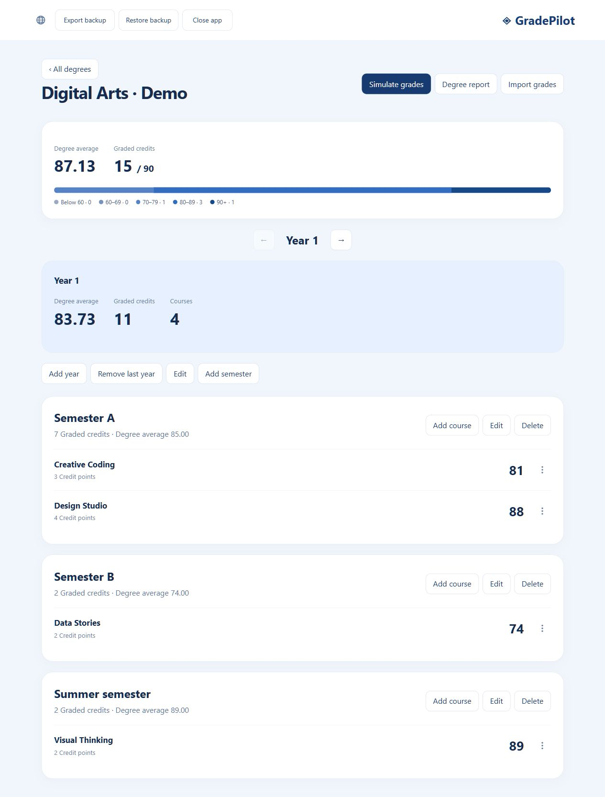
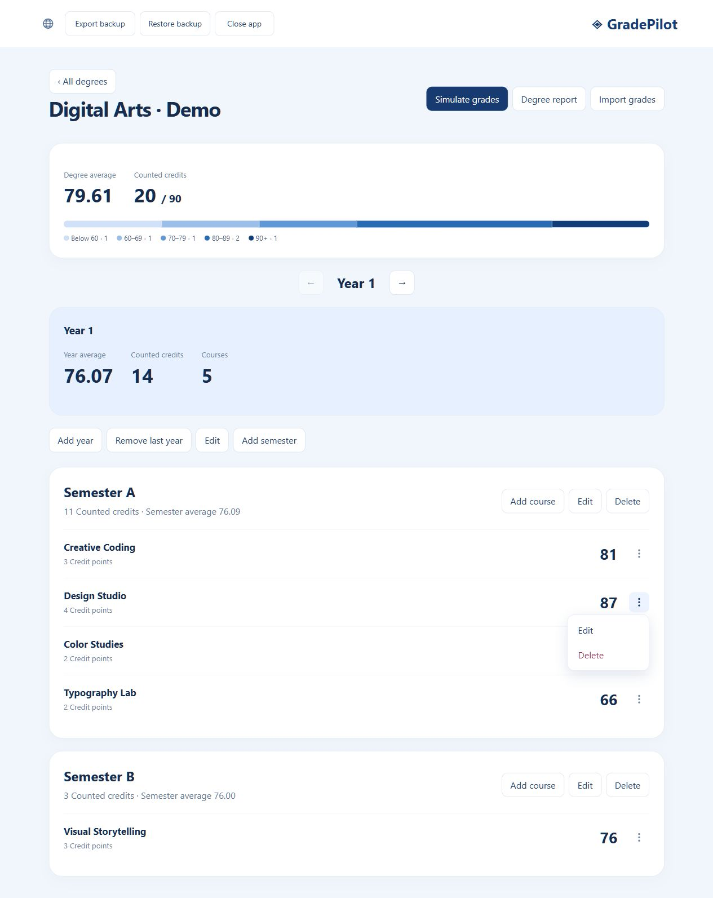
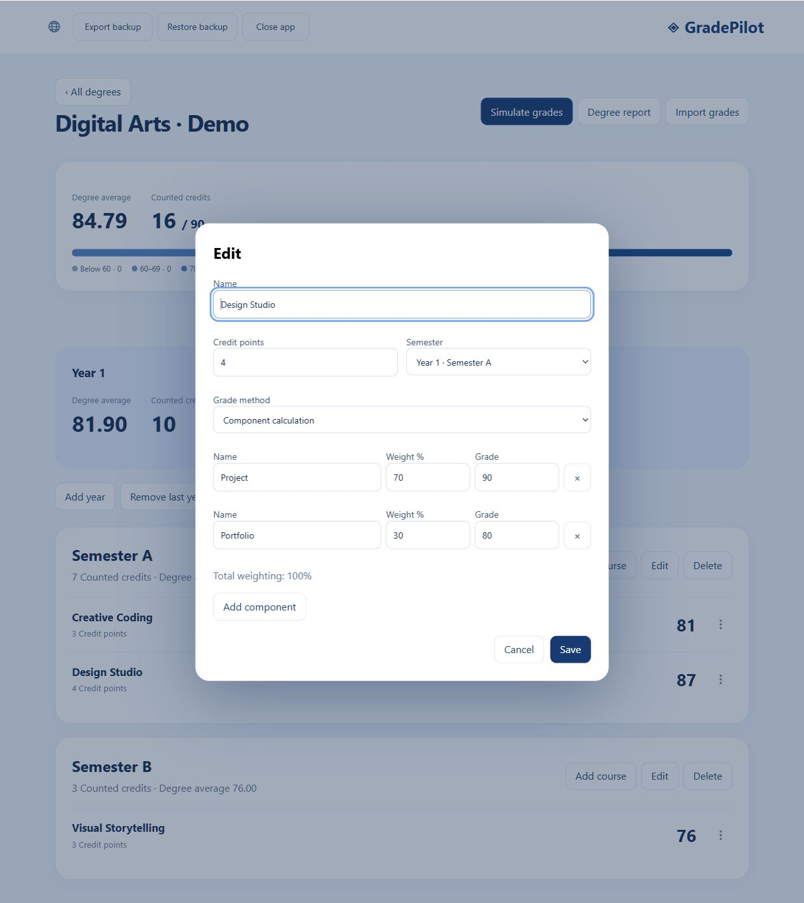
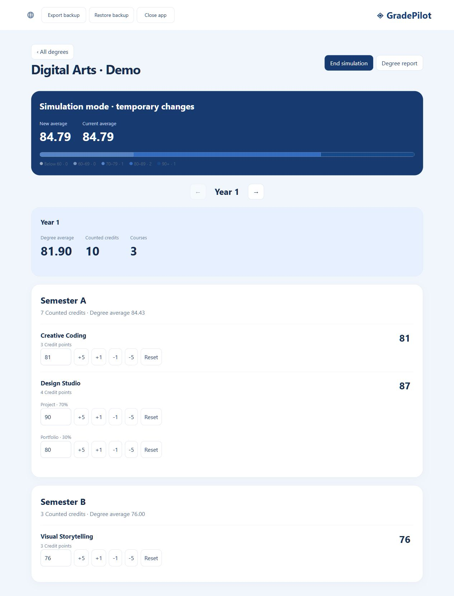
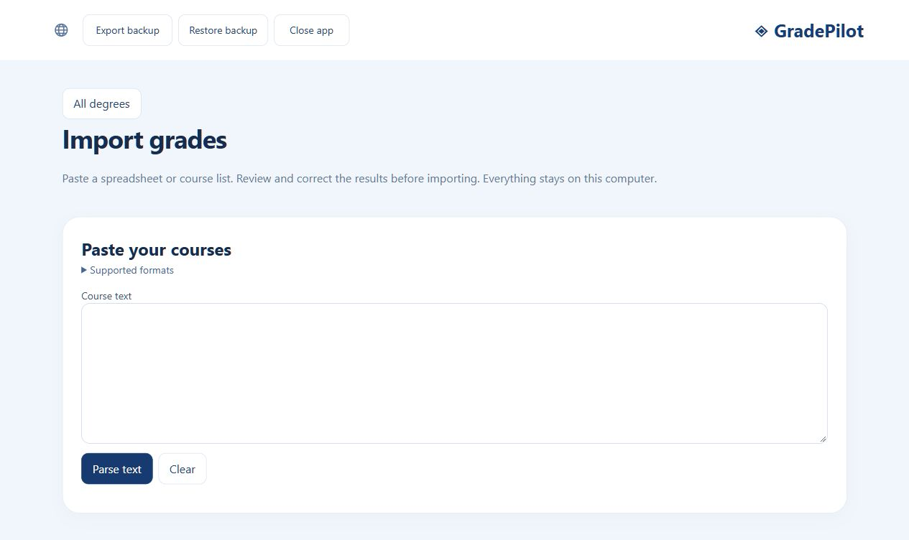
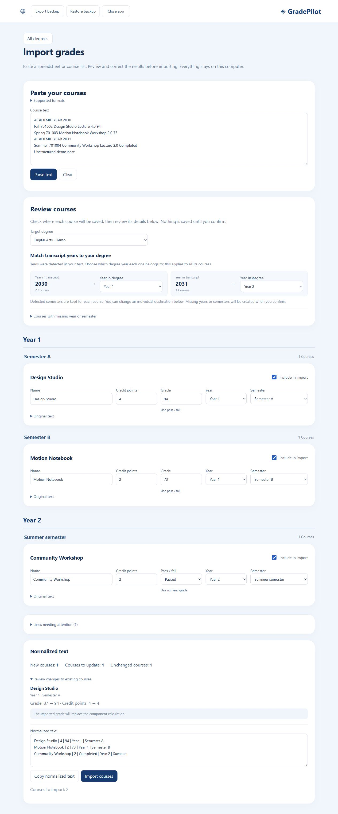
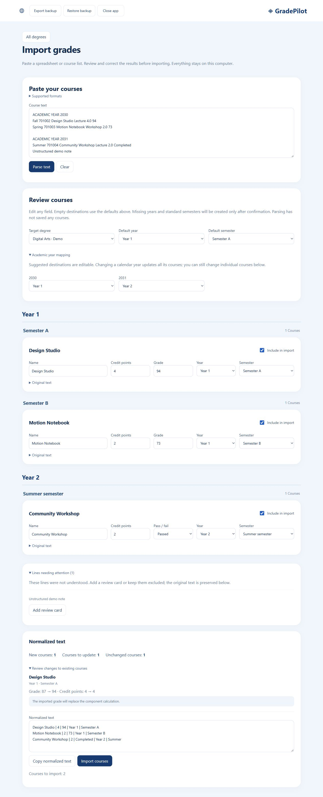
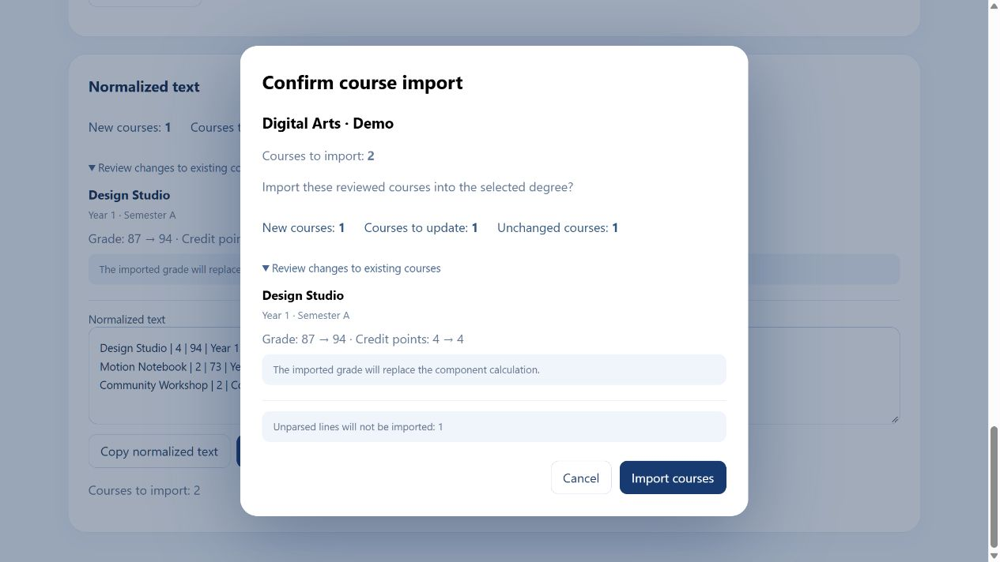
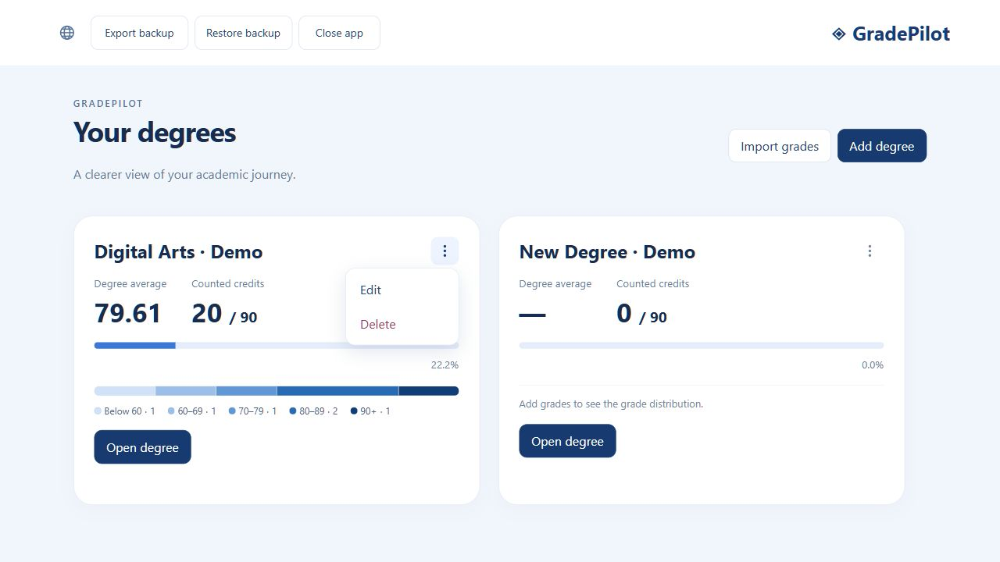
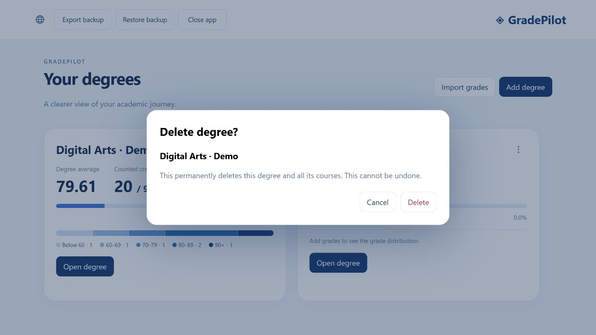

# Degree Grade Calculator · GradePilot

A local-first degree grade calculator for Windows, with a clean blue browser interface and first-class Hebrew and English support. No accounts, cloud services, or separate database installation.

## Why I built GradePilot

I built GradePilot out of frustration with the grade-calculation tools I tried. They had ads or other drawbacks that made a simple task harder than it needed to be. I wanted a clean, local app where I could track my degree, calculate averages, and try different grades without those distractions.

## Using the Windows release

Open `release/GradePilot/DegreeGradeCalculator.exe` by double-clicking. Keep the entire release folder together: it contains the bundled .NET runtime, SQLite library, and browser assets. The executable starts a loopback-only server on an available port and opens your default browser without a terminal window. Opening it again brings up the existing instance. Use **Close app** to shut down; closing the browser alone leaves the server running. Before updating, close the app, replace the complete release folder, and reopen the executable. The current release prevents cached browser assets from hiding UI updates; reload any previously open tab.

## Features

- Multiple degrees with required credits, nominal duration, and flexible academic years.
- Horizontal year navigation with arrows or pointer/touch swipes; vertically stacked semesters. New years start with Semester A and B; add summer or custom semesters as needed.
- Course dialogs with decimal credits, optional direct grades, or weighted components. Courses can move between semesters and years.
- Course and degree Edit/Delete actions are grouped in compact three-dot menus. Deleting a degree requires a separate confirmation naming the degree; Cancel is focused first. Clicking the logo returns to the dashboard.
- Clearly labeled degree, year, and semester averages, graded-credit progress, reports, and five-category grade distribution with distinct light-to-dark blue shades and matching legend markers.
- Temporary simulation with exact grade entry, ±1/±5, reset, and component-level controls in the normal degree layout.
- Hebrew RTL and English LTR, with a persisted language choice.
- JSON export and validated restore; confirmation for restore and deletion.
- Offline text grade import: paste, parse, review editable course cards, correct fields, and confirm. No JSON editing or external AI service.

## Calculations

Repeated courses with exactly the same name use only the latest graded attempt within each summary (academic year, semester, then row order). A newer blank grade does not replace an earlier numeric grade. Its credits and grade distribution count once; all attempts remain visible.

Weighted average = `sum(final grade × credits) / sum(graded course credits)`. Blank grades count toward course counts but not averages, counted credits, or distributions. Binary Passed grades add credits without entering averages or distributions; binary Failed grades add no credits. There is no pass/fail threshold: 45 counts normally. Averages display two decimal places; empty averages display an em dash.

Component grades are `sum(weight percentage × component grade / 100)`, rounded to the nearest whole number with halves rounded upward. That whole-number result enters all summaries. Every component needs a grade before a final grade exists. Weights below 100% are used as entered; weights above 100% show a warning and are **not normalized**. For example, 70% × 80 + 30% × 90 + 10% × 100 = 93. Input grades range from 0 to 100; bonus-weighted final grades can exceed 100.

Simulation clones the selected degree in memory. Component edits recalculate the course and all summaries. Ending simulation discards the clone; exports always contain real saved data. Structural editing is available outside simulation.

## Local data and backups

The database is `%LOCALAPPDATA%\DegreeGradeCalculator\grades.db`. Replacing the release folder does not replace your data. SQLite stores the validated application document transactionally. Back up through **Export backup**; **Restore backup** validates the document before asking to replace all degrees. Backups contain grades and course names, so store them where you would store personal academic records. Maximum backup size is 5 MiB.

## Import grades from text

Choose **Import grades** on the dashboard or degree page. Paste copied text and select **Parse text**, then review course names, credits, grades, years, and semesters in editable cards grouped by destination year and semester. Changing a destination moves the card into its matching group. Choose a target degree. Each course keeps its own detected year and semester. Fallback year/semester controls appear under **Courses with missing year or semester** only when an included course needs them. The section is hidden when all courses are matched; fallback values never override detected destinations. Exclude unwanted rows, fix highlighted fields, and confirm **Import courses** to save. Parsing and preview never write to the database.

Supported formats include pipes (`Creative Coding | 3 | 81`), CSV including quoted names, spreadsheet tabs, semicolons, spaced columns, `Creative Coding 3 credits 81`, and `Creative Coding - 3 - 81`. English/Hebrew headers and year/semester names are recognized. Decimal credits and blank grades are supported. Decimal commas work in non-comma-separated cells or quoted CSV cells.

Hebrew and English academic transcripts are also supported: `שנת לימודים 2030` / `ACADEMIC YEAR 2030`, course codes, א/ב/ק or Fall/Spring/Summer, optional repeated credits, and reversed English rows. Calendar-year sections and table year cells receive suggested degree-year destinations, preserving year gaps. Use the editable Academic year mapping controls to set, for example, 2030 → Year 2 and 2031 → Year 3 for all courses in those years. Explicit headings such as `2030 - first year` are recognized. Missing or ambiguous credits remain blank and require correction. The paste screen includes a collapsed supported-format guide.

This is a conservative local heuristic parser, not arbitrary natural-language understanding. Uncertain values retain their original text and warnings; unsupported rows appear once in an expandable section and can become manual review cards. An advanced column-mapping fallback appears when needed. Unknown destinations can use defaults; missing years and standard semesters (A, B, Summer) are created only after confirmed import. Reimporting the same course in the same year and semester leaves identical data unchanged. Changed credits or grades update the existing course only after a final confirmation showing the old and new values. Courses in other semesters remain separate, and courses absent from the import are preserved. If the paste repeats a course in one destination, the last included row wins. Existing component grades are preserved when their final grade matches; replacing a different component grade is explicitly flagged in the confirmation. The read-only normalized preview can be copied. Limits: 50,000 characters and 1,000 non-empty lines per paste.

Transcript course types include lectures, seminars and workshops. "Completed" and "השלים חובותיו" are imported as binary Passed grades: their credits count toward progress, while they stay out of numeric averages and grade distributions. "טרם" and "No grade" remain ungraded. Each import card has a toggle between numeric and pass/fail grading. Switching back restores the previous number or pass/fail choice on that card without changing other courses. Passed/Failed can also be selected in the course editor. Missing credits still require correction.

## Developers

Stack: .NET 10, ASP.NET Core/Kestrel, Microsoft.Data.Sqlite, SQLite, vanilla HTML/CSS/JavaScript, xUnit. No Node build or runtime requirement.

```powershell
dotnet build
dotnet test
node --test tests/frontend.test.cjs # Optional browser-calculation checks
dotnet run --project src/DegreeGradeCalculator
dotnet publish src/DegreeGradeCalculator -c Release -r win-x64 --self-contained true -o release/GradePilot
```

`--no-browser` suppresses browser launch for integration checks. `GRADEPILOT_DATA` overrides the data directory for isolated test instances. Each data directory has an exclusive instance lock. The server accepts only its loopback host and rejects cross-origin requests.

Parser contract: `POST /api/import/parse-text` accepts `{ "text": "..." }` and an optional `columnMapping` array. The injected `ITextCourseParser` service returns courses, raw values, warning codes, and unparsed lines. Import preview and confirmed import use separate endpoints. These API objects are internal; users edit ordinary controls.

## Screenshots

Fresh English-only captures from the current Windows release. All names, transcript text, and grades are fictional demo data. Long screens are captured in full, and dialogs include every field and action.


<details>
<summary>Degree, course menu, component editor, and simulation</summary>






</details>

<details>
<summary>Import: paste, grouped review, unsupported rows, and confirmation</summary>






</details>

<details>
<summary>Degree menu and deletion confirmation</summary>




</details>
