# GradePilot

A Windows app for tracking degree grades, calculating averages, and trying out hypothetical grades. It supports Hebrew and English, runs locally, and needs no account or separate .NET installation.

## Why I built it

I built GradePilot because I was frustrated with the solutions I tried. Ads and other drawbacks made something simple more annoying than it should have been. I wanted a clean app where I could see my progress and experiment with grades without those distractions.

## Getting started

Download the [Windows release](https://github.com/oric212/GradePilot/releases/tag/v1.1.2), extract it, and open **GradePilot.exe**. Keep the whole folder together. The compressed executable includes .NET and its dependencies, so there is nothing else to install.

Add a degree, then enter courses or use **Import grades**. The app opens in your browser, but your data stays on your computer. Closing the last app tab shuts down the local server; multiple tabs and page refresh are supported.

## What you can do

- Organize multiple degrees by year, semester, and yearly courses.
- Enter direct grades, pass/fail results, or weighted components.
- See separate degree, year, and semester averages, credit progress, and grade ranges.
- Open **Insights / תובנות** beside the degree report to see grades from highest to lowest, the courses that raise or lower your GPA most, and a cumulative-average graph. It only reads saved results.
- Simulate grades without changing saved results. Changed courses are highlighted until you restore their original values or press Reset. For a blank simulated grade, **+5 starts it at 100**.
- Switch between Hebrew and English, and export or restore a backup.

**Add course** stays visible. Editing and deleting courses, semesters, or degrees uses the three-dot menus, with confirmation before deletion.

## Importing grades

Open **Import grades**, paste a course list or transcript, and select **Parse text**. Check the year mappings and grouped course cards, correct anything missing, then confirm.

The importer supports spreadsheet data and Hebrew/English transcripts. Its supported-format guide is inside the app. Completed statuses become pass/fail grades; pending results stay blank. Nothing is saved during review, and reimported changes require confirmation before replacing existing courses.

## How averages work

Averages are weighted by course credits. Blank grades stay out of averages; Passed counts toward credits without adding a numeric grade, and Failed adds no credits.

Required degree credits and entered grades are whole numbers. Course credits may be fractional (such as 2.5), and averages display two decimal places.

Component results are rounded to whole grades. Bonus weights above 100% are used as entered, with a warning. Repeated courses with exactly the same name use the latest graded attempt; a newer blank result does not replace it.

Yearly courses count once in year and degree summaries, without affecting an individual semester’s average.

In Insights, GPA impact means the difference between your average with a course and without it. The graph follows saved years and semesters, adds yearly courses at year end, and applies the repeated-course rule at each point.

## Your data

Saved data lives in `%LOCALAPPDATA%\DegreeGradeCalculator\grades.db`. Updating the app keeps it. Use **Export backup** before a restore, since restoring replaces all saved degrees.

Multiple tabs cannot silently overwrite each other: if another tab saves first, you’ll be asked to **Reload latest data** before reapplying your edit.

## Building it

Built with .NET 10, SQLite, and plain HTML/CSS/JavaScript.

```powershell
dotnet build
dotnet test
node --test tests/frontend.test.cjs # Optional frontend checks
dotnet run --project src/DegreeGradeCalculator
dotnet publish src/DegreeGradeCalculator -p:PublishProfile=Windows -o release/GradePilot
```

For unattended runs, use `--no-browser` or set `LocalAppMode=false` to disable browser-session shutdown. `GRADEPILOT_DATA` selects an isolated data folder for testing.

## Screenshots

A walkthrough using a fictional **Digital Arts · Demo** degree. All course names, transcript text, and grades are invented. These fresh English-only captures focus on the relevant controls.

**Start here:** open a degree, import grades, or create a new degree from the dashboard.

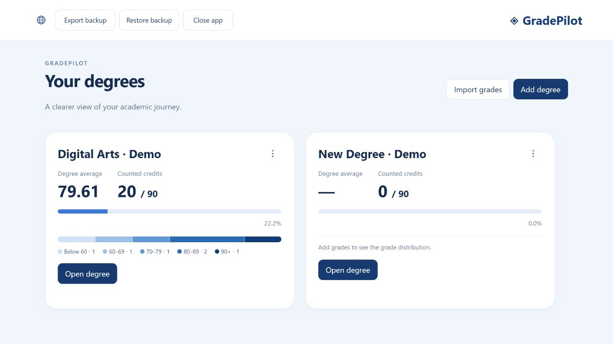

<details>
<summary>Explore averages, edit courses, and simulate grades</summary>

**Open a degree.** Degree and year averages have separate labels, with five distinct blue grade ranges.

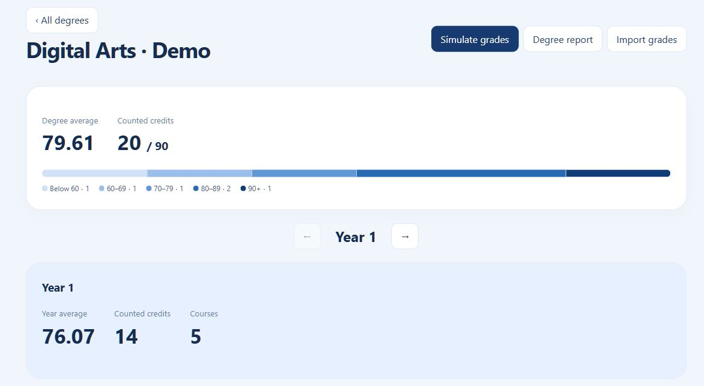

**Open a course’s three-dot menu** to edit or delete that course. Each semester shows its own average.

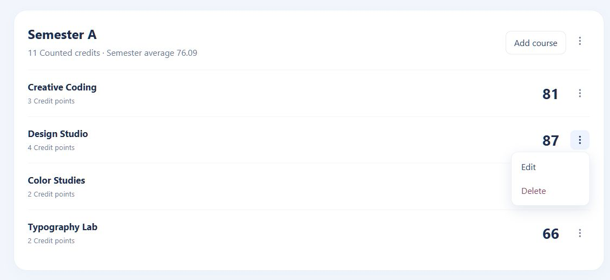

**Edit weighted components.** Choose a grading method, enter component weights and grades, then save.

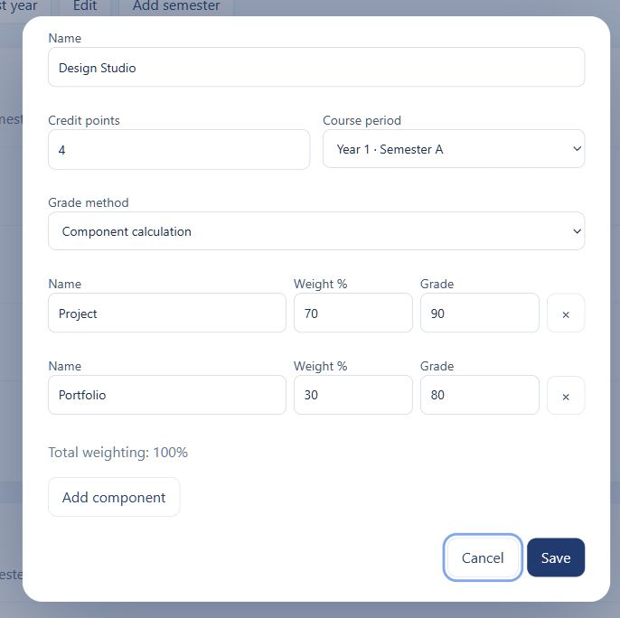

**Start simulation** to compare a prominent hypothetical average with the smaller saved average in a light blue card.

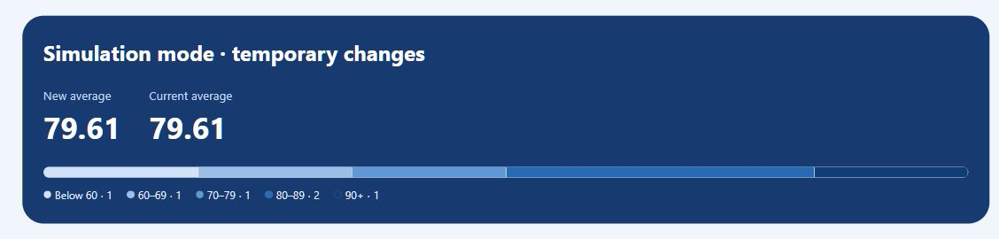

**Adjust grades with compact blue controls.** Reset sits beside the signed buttons and restores that course or component.

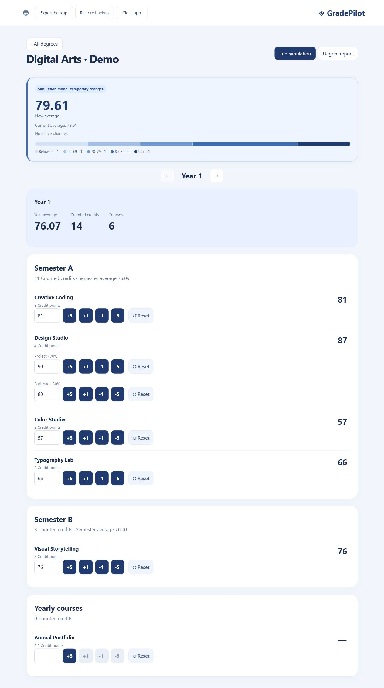

**Changed courses receive a blue highlight.** Manually returning to the original grade or pressing Reset removes the highlight and changed count.

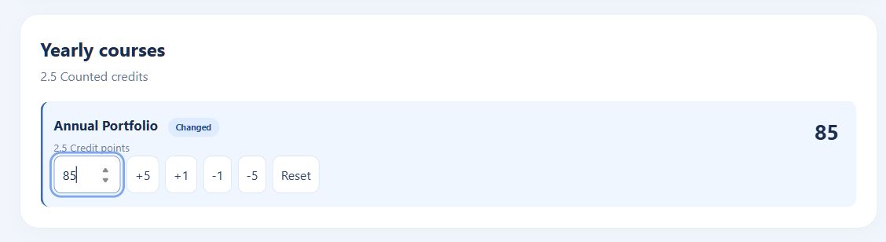

**Start a blank simulated grade at 100 with +5.** The other signed buttons stay disabled until it has a number; Reset restores the original blank grade. This shortcut also works for blank components and never saves a real grade.

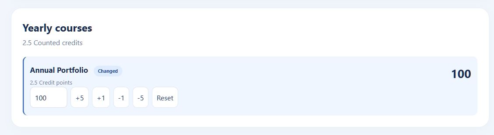

**Choose Yearly in the course form** for an annual course. It appears after the semesters and contributes only to year and degree summaries.

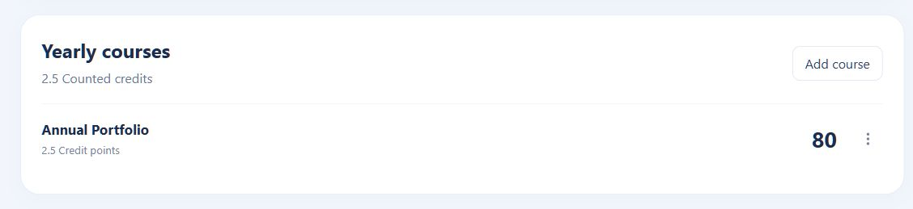

</details>

<details>
<summary>Import grades: paste → map years → review → confirm</summary>

**1. Paste your course text and select Parse text.** Supported formats stay in a collapsed guide.

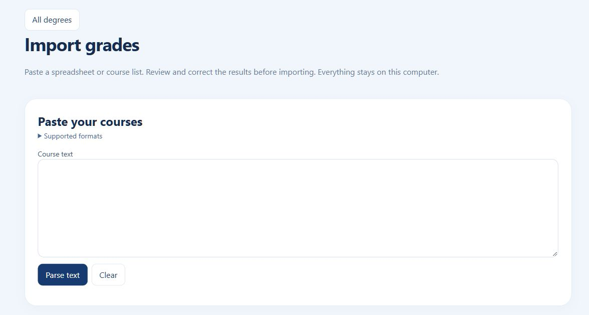

**2. Choose the degree and map academic years.** Each course retains its own semester; mappings can be adjusted.

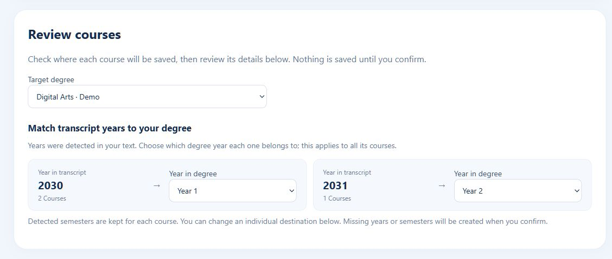

**3. Review courses grouped by year and semester.** Edit an individual destination or toggle only that course between numeric and pass/fail grading.

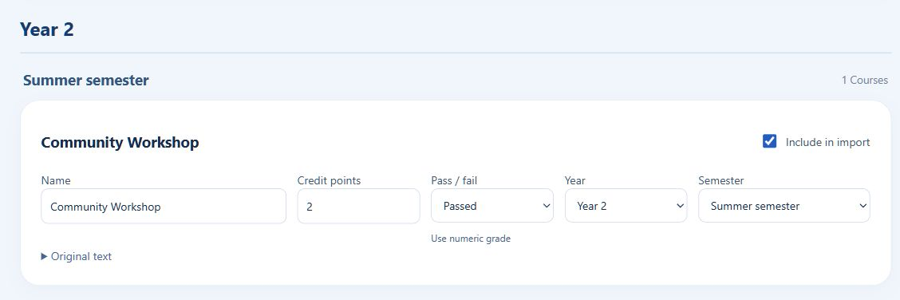

**If some rows need attention,** open one consolidated section to view them or add an editable review card.

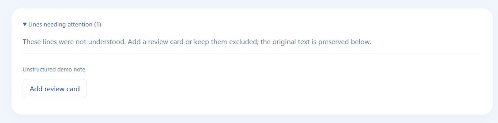

**4. Confirm updates.** Reimported changes show old and new values before existing courses are replaced.

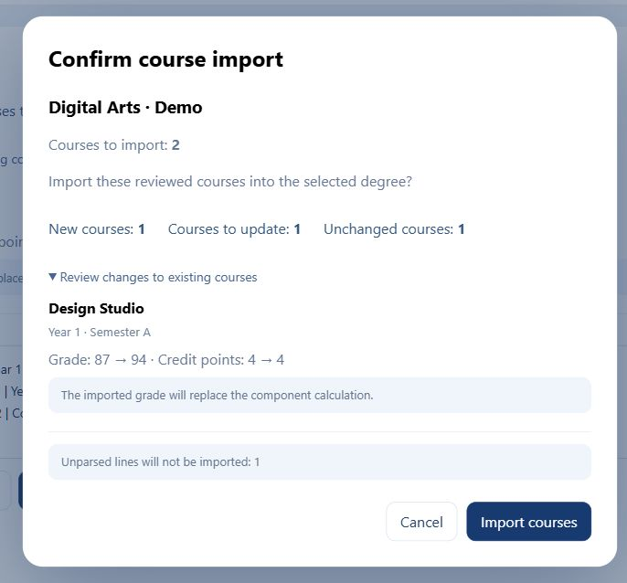

</details>

<details>
<summary>Manage degrees, years, and available semesters</summary>

**Add course stays visible.** A semester’s three-dot menu holds only Edit semester and Delete semester; deletion requires confirmation.

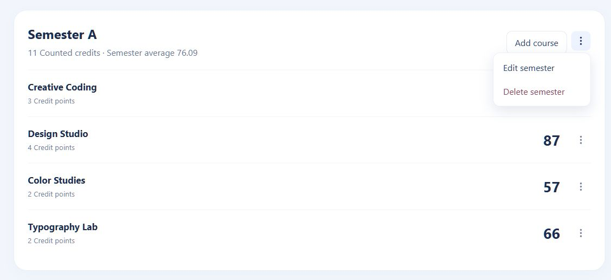

**Degree settings and deletion** live inside the three-dot menu.

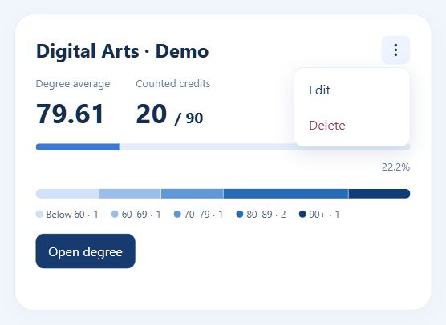

**Deleting a degree requires confirmation** naming the affected degree.

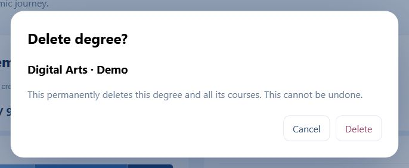

**Removing the last year also requires confirmation,** including its course count.

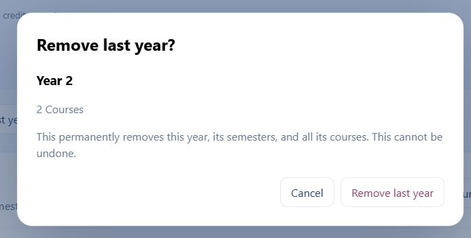

**Add only missing semesters.** This demo year already has A and B, so the dropdown offers only Summer. Choices are localized in Hebrew mode.

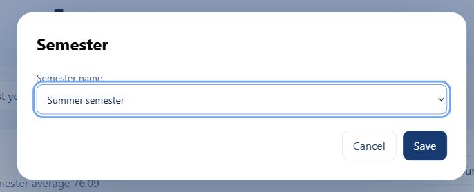

</details>

<details>
<summary>Saving from multiple tabs</summary>

**Newer data is protected.** If another tab has saved, a stale save is blocked. Select Reload latest data, then reapply your intended edit.

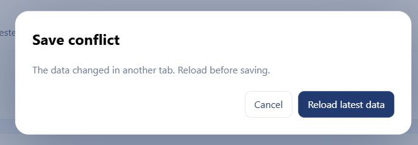

</details>
